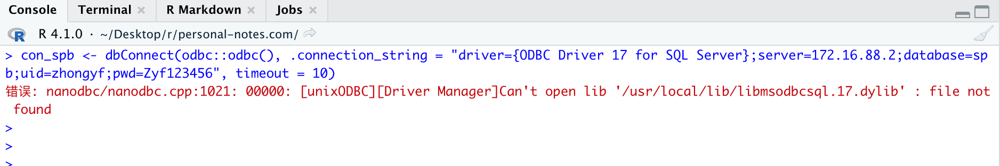

# 前言

2021年5月19日R更新了,版本号R-4.1.0,现在已经原生支持Apple silicon arm64.也就是m1芯片电脑已经原生支持R语言，不需要通过rosetta转移。

同样，rstudio也更新了桌面预览版支持M1-R,非预览版无法正常启动。

[rstudio preview](https://www.rstudio.com/products/rstudio/download/preview/)下载地址。

接下来，我们就简单测试下4.1.0下R的速度兼容性，以及是否已经支持很多R包了。


> 因为本人是商业数据分析师，所以测试内容仅仅只是简单的数据处理的R包，如tidyverse,data.table,rmarkdown,bookdown,readxl,openxlsx等


## R安装

- 官网安装


官网下载正常安装即可，或者通过homebrew安装。

## R包安装

### 数据处理包

我常用data.table处理数据,所以第一个安装的R包是data.table，正常安装。接下来安装tidyverse报错，看原因是stringi没办法正确安装，解决办法如下：

- stringi

```
packageurl <- "https://cran.r-project.org/src/contrib/Archive/stringi/stringi_1.1.7.tar.gz"
install.packages(packageurl, repos=NULL, type="source")
```

安装stringi包后，tidyverse即可正常使用。

### 数据库相关

对于我常用的odbc,DBI都可以正常安装，甚至我成功安装SQL SERVER的驱动，如下所示：


但是无法正常连接数据库，据说微软计划下一个版本的odbc会支持m1.
.

至于其他的数据库比如mysql，我想是可以成功，没测试。


